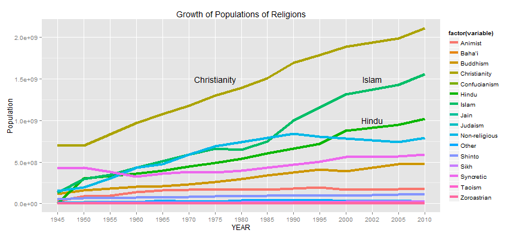
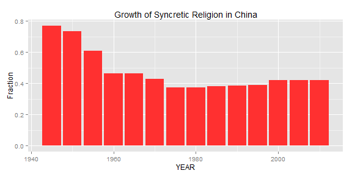

--- 
title       : World Religions Since 1945
subtitle    : ARDA World Relgion Dataset
author      : edettman (dettmanej@gmail.com)
job         : 
framework   : io2012        # {io2012, html5slides, shower, dzslides, ...}
highlighter : highlight.js  # {highlight.js, prettify, highlight}
hitheme     : default      # 
widgets     : []            # {mathjax, quiz, bootstrap}
mode        : selfcontained # {standalone, draft}
knit        : slidify::knit2slides
--- 
<style>
.title-slide {
  background-color: #FFFFFF; /* #EDE0CF; ; #CA9F9D*/
}
em {
  font-style: italic
}

</style>

## ARDA Dataset

- World Religion Dataset (WRD) characterizes religion by country since 1945
- Data in five year increments
- Sources included census data and specific estimates (Some imputed)
- [Shinyapp](https://edettman.shinyapps.io/project) looks at the total fractions for each major religion by country and illustrates overall distributions of religions and trends in growth
- https://edettman.shinyapps.io/project


```
## [1] Year                                              
## [2] Country name                                      
## [3] Christianity: Total number of adherents (CHRSTGEN)
## [4] Judaism: Total number of adherents                
## [5] Islam: Total number of adherents                  
## [6] Buddhism: Total number of adherents               
## [7] Zoroastrian: Total number of adherents            
## [8] Hindu: Total number of adherents                  
## 88 Levels:  ... Zoroastrian: Total percentage adherents (ZOROGENPCT)
```

--- .class #id 

## Growth of Religious Populations Since 1945  

 

- Above line graph shows the overall populations of each indicated religion since 1945 
- ARDA dataset shows these populations at the level of the individual country 
- This [Shinyapp](https://edettman.shinyapps.io/project) can be used to investigate these trends at a more granular level

---
## World Geographic Plot of Individual Religions  
#### Christianity in 2010
<!-- GeoChart generated in R 3.2.1 by googleVis 0.5.10 package -->
<!-- Wed Oct 21 11:54:37 2015 -->


<!-- jsHeader -->
<script type="text/javascript">
 
// jsData 
function gvisDataGeoChartID29fa46d1865da () {
var data = new google.visualization.DataTable();
var datajson =
[
 [
 "             United States of America",
0.7454 
],
[
 "                               Canada",
0.7661 
],
[
 "                              Bahamas",
0.966 
],
[
 "                                 Cuba",
0.6589 
],
[
 "                                Haiti",
0.82 
],
[
 "                   Dominican Republic",
0.87 
],
[
 "                              Jamaica",
0.6881 
],
[
 "                  Trinidad and Tobago",
0.5588 
],
[
 "                             Barbados",
0.6434 
],
[
 "                             Dominica",
0.92 
],
[
 "                              Grenada",
0.87 
],
[
 "                            St. Lucia",
0.9218 
],
[
 "       St. Vincent and the Grenadines",
0.899 
],
[
 "",
null 
],
[
 "                  St. Kitts and Nevis",
0.8979 
],
[
 "                               Mexico",
0.9686 
],
[
 "                               Belize",
0.7365 
],
[
 "                            Guatemala",
0.95 
],
[
 "                             Honduras",
0.89 
],
[
 "                          El Salvador",
0.861 
],
[
 "                            Nicaragua",
0.9005 
],
[
 "                           Costa Rica",
0.8822 
],
[
 "                               Panama",
0.9793 
],
[
 "                             Colombia",
0.9701 
],
[
 "                            Venezuela",
0.95 
],
[
 "                               Guyana",
0.5575 
],
[
 "                             Suriname",
0.48 
],
[
 "                              Ecuador",
0.903 
],
[
 "                                 Peru",
0.938 
],
[
 "                               Brazil",
0.8823 
],
[
 "                              Bolivia",
0.9426 
],
[
 "                             Paraguay",
0.951 
],
[
 "                                Chile",
0.9128 
],
[
 "                            Argentina",
0.8515 
],
[
 "                              Uruguay",
0.8183 
],
[
 "                       United Kingdom",
0.6263 
],
[
 "                              Ireland",
0.9299 
],
[
 "                          Netherlands",
0.5794 
],
[
 "                              Belgium",
0.692 
],
[
 "                           Luxembourg",
0.9106 
],
[
 "                               France",
0.7019 
],
[
 "                               Monaco",
0.802 
],
[
 "                        Liechtenstein",
0.8678 
],
[
 "                          Switzerland",
0.8056 
],
[
 "                                Spain",
0.8056 
],
[
 "                              Andorra",
0.907 
],
[
 "                             Portugal",
0.8573 
],
[
 "                              Germany",
0.7078 
],
[
 "                               Poland",
0.9046 
],
[
 "                              Austria",
0.73 
],
[
 "                              Hungary",
0.6736 
],
[
 "                       Czech Republic",
0.2138 
],
[
 "                             Slovakia",
0.7548 
],
[
 "                                Italy",
0.7939 
],
[
 "                           San Marino",
0.8631 
],
[
 "                                Malta",
0.9727 
],
[
 "                              Albania",
0.2144 
],
[
 "                           Montenegro",
0.7593 
],
[
 "                            Macedonia",
0.6374 
],
[
 "                              Croatia",
0.9137 
],
[
 "                               Serbia",
0.9122 
],
[
 "               Bosnia and Herzegovina",
0.52 
],
[
 "                               Kosovo",
0.0369 
],
[
 "                             Slovenia",
0.67 
],
[
 "                               Greece",
0.9438 
],
[
 "                               Cyprus",
0.7453 
],
[
 "                             Bulgaria",
0.8227 
],
[
 "                              Moldova",
0.8213 
],
[
 "                              Romania",
0.9751 
],
[
 "                               Russia",
0.7423 
],
[
 "                              Estonia",
0.2837 
],
[
 "                               Latvia",
0.7902 
],
[
 "                            Lithuania",
0.8296 
],
[
 "                              Ukraine",
0.852 
],
[
 "                              Belarus",
0.5684 
],
[
 "                              Armenia",
0.951 
],
[
 "                              Georgia",
0.798 
],
[
 "                           Azerbaijan",
0.0241 
],
[
 "                              Finland",
0.794 
],
[
 "                               Sweden",
0.7606 
],
[
 "                               Norway",
0.8401 
],
[
 "                              Denmark",
0.8172 
],
[
 "                              Iceland",
0.9155 
],
[
 "                           Cape Verde",
0.9478 
],
[
 "                Sao Tome and Principe",
0.9441 
],
[
 "                        Guinea-Bissau",
0.1088 
],
[
 "                    Equatorial Guinea",
0.892 
],
[
 "                               Gambia",
0.0435 
],
[
 "                                 Mali",
0.03 
],
[
 "                              Senegal",
0.0349 
],
[
 "                                Benin",
0.4 
],
[
 "                           Mauritania",
0.0026 
],
[
 "                                Niger",
0.039 
],
[
 "                          Ivory Coast",
0.375 
],
[
 "                               Guinea",
0.08 
],
[
 "                         Burkina Faso",
0.2935 
],
[
 "                              Liberia",
0.85 
],
[
 "                         Sierra Leone",
0.1905 
],
[
 "                                Ghana",
0.7034 
],
[
 "                                 Togo",
0.48 
],
[
 "                             Cameroon",
0.4952 
],
[
 "                              Nigeria",
0.42 
],
[
 "                                Gabon",
0.7472 
],
[
 "             Central African Republic",
0.492 
],
[
 "                                 Chad",
0.34 
],
[
 "                  Congo (Republic of)",
0.8063 
],
[
 "     Democratic Republic of the Congo",
0.9302 
],
[
 "                               Uganda",
0.833 
],
[
 "                                Kenya",
0.8063 
],
[
 "                             Tanzania",
0.4777 
],
[
 "                              Burundi",
0.889 
],
[
 "                               Rwanda",
0.8945 
],
[
 "                              Somalia",
5e-04 
],
[
 "                             Djibouti",
0.0139 
],
[
 "                             Ethiopia",
0.6156 
],
[
 "                              Eritrea",
0.575 
],
[
 "                               Angola",
0.8912 
],
[
 "                           Mozambique",
0.4734 
],
[
 "                               Zambia",
0.87 
],
[
 "                             Zimbabwe",
0.8188 
],
[
 "                               Malawi",
0.7228 
],
[
 "                         South Africa",
0.8094 
],
[
 "                              Namibia",
0.87 
],
[
 "                              Lesotho",
0.9418 
],
[
 "                             Botswana",
0.692 
],
[
 "                            Swaziland",
0.7843 
],
[
 "                           Madagascar",
0.5858 
],
[
 "                              Comoros",
0.0013 
],
[
 "                            Mauritius",
0.3252 
],
[
 "                           Seychelles",
0.9365 
],
[
 "                              Morocco",
0.01 
],
[
 "                              Algeria",
0.008 
],
[
 "                              Tunisia",
0.0035 
],
[
 "                                Libya",
0.03 
],
[
 "                                Sudan",
0.0715 
],
[
 "                                 Iran",
0.0016 
],
[
 "                               Turkey",
0.0042 
],
[
 "                                 Iraq",
0.0189 
],
[
 "                                Egypt",
0.1212 
],
[
 "                                Syria",
0.0752 
],
[
 "                              Lebanon",
0.407 
],
[
 "                               Jordan",
0.03 
],
[
 "                               Israel",
0.02 
],
[
 "                         Saudi Arabia",
0.03 
],
[
 "                                Yemen",
0 
],
[
 "                               Kuwait",
0 
],
[
 "                              Bahrain",
0.098 
],
[
 "                                Qatar",
0.1445 
],
[
 "                 United Arab Emirates",
0.0714 
],
[
 "                                 Oman",
0.0334 
],
[
 "                          Afghanistan",
3e-04 
],
[
 "                         Turkmenistan",
0.09 
],
[
 "                           Tajikistan",
0.0202 
],
[
 "                           Kyrgyzstan",
0.1007 
],
[
 "                           Uzbekistan",
0.05 
],
[
 "                           Kazakhstan",
0.29 
],
[
 "                                China",
0.058 
],
[
 "                             Mongolia",
0.0194 
],
[
 "                               Taiwan",
0.0541 
],
[
 "                          North Korea",
0.0166 
],
[
 "                          South Korea",
0.2859 
],
[
 "                                Japan",
0.0196 
],
[
 "                                India",
0.0234 
],
[
 "                               Bhutan",
0.0122 
],
[
 "                             Pakistan",
0.017 
],
[
 "                           Bangladesh",
0.002 
],
[
 "                              Myanmar",
0.0776 
],
[
 "                            Sri Lanka",
0.0726 
],
[
 "                             Maldives",
0.0045 
],
[
 "                                Nepal",
0.0142 
],
[
 "                             Thailand",
0.006 
],
[
 "                             Cambodia",
0.0037 
],
[
 "                                 Laos",
0.015 
],
[
 "                              Vietnam",
0.091 
],
[
 "                             Malaysia",
0.0826 
],
[
 "                            Singapore",
0.1821 
],
[
 "                               Brunei",
0.03 
],
[
 "                          Philippines",
0.9174 
],
[
 "                            Indonesia",
0.106 
],
[
 "                           East Timor",
0.98 
],
[
 "                            Australia",
0.6145 
],
[
 "                     Papua New Guinea",
0.96 
],
[
 "                          New Zealand",
0.5407 
],
[
 "                              Vanuatu",
0.85 
],
[
 "                      Solomon Islands",
0.9 
],
[
 "                             Kiribati",
0.96 
],
[
 "                               Tuvalu",
0.9699 
],
[
 "                                 Fiji",
0.64 
],
[
 "                                Tonga",
0.9421 
],
[
 "                                Nauru",
0.9699 
],
[
 "                     Marshall Islands",
0.9341 
],
[
 "                                Palau",
0.8606 
],
[
 "       Federated States of Micronesia",
0.8651 
],
[
 "                                Samoa",
0.9538 
] 
];
data.addColumn('string','Country');
data.addColumn('number','Freq');
data.addRows(datajson);
return(data);
}
 
// jsDrawChart
function drawChartGeoChartID29fa46d1865da() {
var data = gvisDataGeoChartID29fa46d1865da();
var options = {};
options["width"] =    600;
options["height"] =    300;
options["title"] = "Christianity in 2010";
options["colorAxis"] = {colors: ['#00853f', 'black', '#e31b23']};
options["datalessRegionColor"] = "#ffffff";

    var chart = new google.visualization.GeoChart(
    document.getElementById('GeoChartID29fa46d1865da')
    );
    chart.draw(data,options);
    

}
  
 
// jsDisplayChart
(function() {
var pkgs = window.__gvisPackages = window.__gvisPackages || [];
var callbacks = window.__gvisCallbacks = window.__gvisCallbacks || [];
var chartid = "geochart";
  
// Manually see if chartid is in pkgs (not all browsers support Array.indexOf)
var i, newPackage = true;
for (i = 0; newPackage && i < pkgs.length; i++) {
if (pkgs[i] === chartid)
newPackage = false;
}
if (newPackage)
  pkgs.push(chartid);
  
// Add the drawChart function to the global list of callbacks
callbacks.push(drawChartGeoChartID29fa46d1865da);
})();
function displayChartGeoChartID29fa46d1865da() {
  var pkgs = window.__gvisPackages = window.__gvisPackages || [];
  var callbacks = window.__gvisCallbacks = window.__gvisCallbacks || [];
  window.clearTimeout(window.__gvisLoad);
  // The timeout is set to 100 because otherwise the container div we are
  // targeting might not be part of the document yet
  window.__gvisLoad = setTimeout(function() {
  var pkgCount = pkgs.length;
  google.load("visualization", "1", { packages:pkgs, callback: function() {
  if (pkgCount != pkgs.length) {
  // Race condition where another setTimeout call snuck in after us; if
  // that call added a package, we must not shift its callback
  return;
}
while (callbacks.length > 0)
callbacks.shift()();
} });
}, 100);
}
 
// jsFooter
</script>
 
<!-- jsChart -->  
<script type="text/javascript" src="https://www.google.com/jsapi?callback=displayChartGeoChartID29fa46d1865da"></script>
 
<!-- divChart -->
  
<div id="GeoChartID29fa46d1865da" 
  style="width: 600; height: 300;">
</div>
- On the [Shinyapp](https://edettman.shinyapps.io/project), the user can select an individual religion and year
- A heatmap of the fraction of people adhering to that relgion by year is then displayed in the *Map* tab
- Green is low, black is middle, red is high, and white is missing data
- Hover over individual countries to see the fraction of that religion

---
## Trends in Individual Countries



- On the [Shinyapp](https://edettman.shinyapps.io/project), the user can also select an individual country
- _Growth_ tab will show the trends in the selected relgion in that country between 1945 and 2010
- A third _Table_ tab shows a sortable and searchable table of all countries in the selected year for the selected religion
